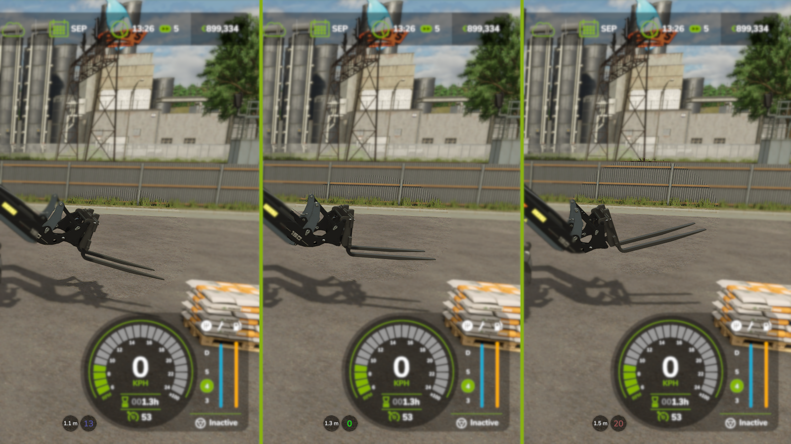
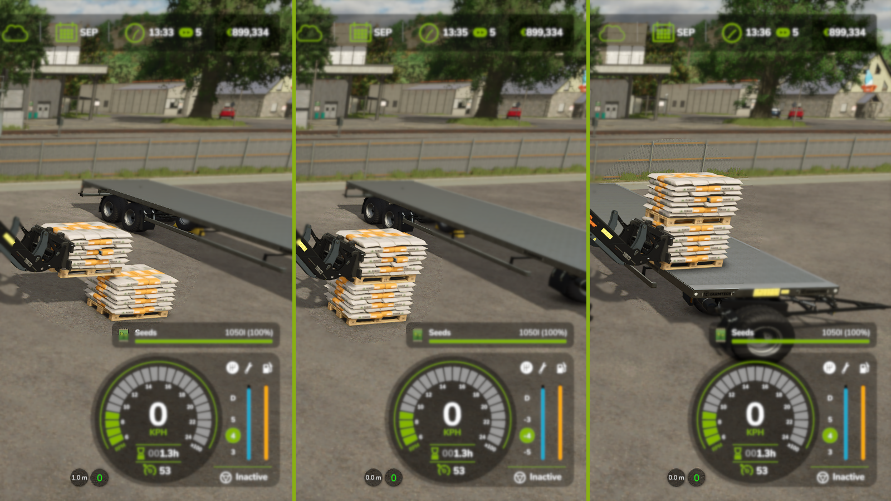

# FS25_ToolInclinationHelper

## Acknowledgements

The mod icon uses icons from [Forklift icons created by Freepik - Flaticon](https://www.flaticon.com/free-icons/forklift)
Some ideas for basic overlay usage were taken from https://github.com/ZhooL/FS25_EnhancedVehicle/tree/main

## Modhub Link

pending

## Mod description

This mod displays whether or not your forks (or other implements) are level (= horizontal orientation) or not.
Additionally, it displays the distance of the tool to the ground or to whatever is below it (bales, pallets, trailer, ...).

You can choose between icons or degrees in the settings, you can turn on or off color coding if set to "degrees", and you can move the display around, if needed.

The mod works for at least any base game front loader tool, wheel loader tool, telehandler tool, skid steer tool and forklift.
Note that the "level" orientation depends on how the tool was designed.

## Screenshots

## How to install

1. Download the newest zip from the [Releases page](https://github.com/Timmeey86/FS25_ToolInclinationHelper/releases)
1. Place the zip file in your FS25 mod folder
1. Start the game and use like any other mod

## How to debug/code

1. Obviously, own a copy of Farming Simulator 25
1. Clone this folder anywhere
1. Use Visual Code with at least the Lua Language Server Plugin for coding
1. When testing, execute copytofs.bat
1. Debug in Giants Studio or just launch the game
